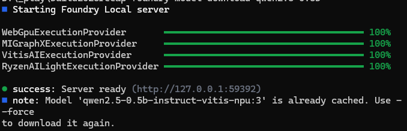
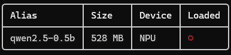
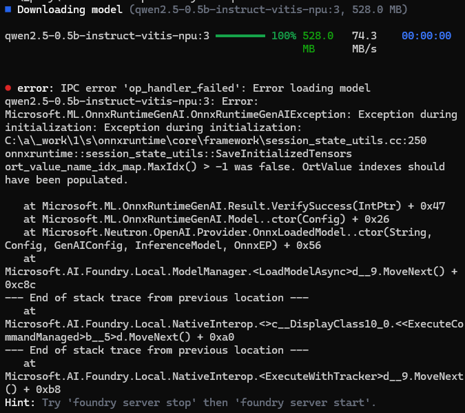
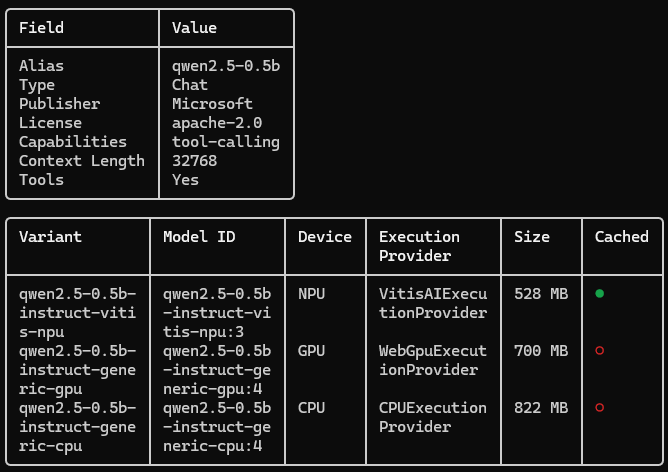
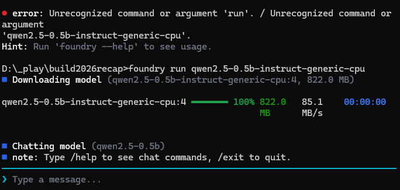
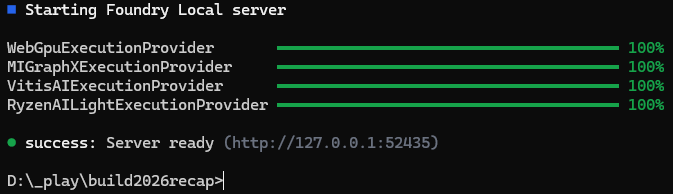

# Coding with Microsoft Foundry Local on Windows

## What is Microsoft Foundry Local?

Foundry Local is an AI solution that runs entirely on the user's device. It also provides an SDK (C#, JavaScript, Rust, and Python) that helps you build apps that interact with Foundry Local.

## Installation

To install Foundry Local, follow these steps:

### Windows

```bash
winget install Microsoft.FoundryLocal
```

## Exploring CLI commands

Try the following Foundry Local CLI commands:

#### Detect the CLI version:

```bash
foundry --version
```

<details>
<summary>
Expected output:
</summary>
0.10.2
</details>

---

#### View the list of CLI commands:

```bash
foundry --help
```

<details>
<summary>
Expected output:
</summary>
<pre>
Description:
  Run generative AI models locally, privately, and offline.

  Command groups:
    Model:  model, cache
    Run:    run, chat, complete, transcribe
    Server: server
    Setup:  config
    Help:   status, report

Usage:
  foundry [command] [options]

Options:
  -?, -h, --help         Show help and usage information
  --version              Show version information
  -o, --output <format>  Output format (text|json). Defaults to text.
                         [default: Text]

Commands:
  model                      Discover, inspect, download, load, and
                             unload local models
  chat <model>               Start an interactive local chat session
  complete <model> <prompt>  Generate one stateless text completion
  run <model>                Run a model with automatic routing to chat
                             or transcription
  server                     Start, stop, restart, inspect, and
                             troubleshoot the local Foundry daemon
  cache                      Inspect and manage downloaded model cache
                             entries
  config                     View and edit persistent Foundry CLI settings
  status                     Show system, service, model, and
                             connectivity diagnostics
  report                     Open a pre-filled GitHub issue with
                             diagnostics
  transcribe                 Start an interactive local speech
                             transcription session or transcribe a file
</pre>
</details>

___

#### Download a model into local cache:

```bash
foundry model download qwen2.5-0.5b
```

<details>
<summary>
Expected output:
</summary>



</details>

___
#### List models in local cache:

```bash
foundry cache list
```

<details>
<summary>
Expected output:
</summary>



</details>

___
#### Remove a model from local cache:

```bash
foundry cache remove qwen2.5-0.5b
```

<details>
<summary>
Expected output:
</summary>
Remove qwen2.5-0.5b from the cache? [y/n] (n): y<br>
● success: Removed 'qwen2.5-0.5b' from the cache.
</details>

___
#### Download and run a model:

```bash
foundry run qwen2.5-0.5b
```

<details>
<summary>
My computer does not have an NPU, so the default model downloads OK, but cannot run.<br>
Expected output:
</summary>



</details>
<br />

> [!TIP]
> If you get an error when running a model, it may mean that your hardware is incompatible with the specific model that was downloaded. You can try looking ar variants of that model for different processor configurations. To view the variants for a model (Example: qwen2.5-0.5b), type the following command:
>
> ```bash
> foundry model info qwen2.5-0.5b
> ```
>
<details>
<summary>
Expected Output:
</summary>



</details>
> You can then try one of the variants like `qwen2.5-0.5b-instruct-generic-cpu` with:
>
> ```bash
> foundry run qwen2.5-0.5b-instruct-generic-cpu
> ```
<details>
<summary>
Expected Output:
</summary>



</details>
___

The above puts the user in a CLI interactive mode. You can then send prompt to the model. Let's ask the model to create for us a C# program that does temperature conversion. Type in the following prompt:

```
Write a C# console app that converts temperature from C to F and also from F to C.
```

<details>
<summary>
Expected output:
</summary>
Certainly! Below is a simple C# console application that takes user input for Celsius (C) or Fahrenheit (F) values and displays the corresponding temperature in both units.

```c#
using System;

namespace TemperatureConverterApp
{
    class Program
    {
        static void Main(string[] args)
        {
            Console.WriteLine("Enter temperature value in Celsius (C):");
            string cValue = Console.ReadLine();

            Console.Write("To convert to Fahrenheit: ");
            string fValue = Console.ReadLine();

            double cTemp = ConvertCelsius(cValue);
            double fTemp = ConvertToFahrenheit(fValue);

            Console.WriteLine($"Temperature: {cTemp}°C")
                .Append(", ")
                .Append($"in Fahrenheit: {fTemp}°F");

            Console.ReadKey(); // Wait for key press before closing the console window.
        }

        static double ConvertCelsius(string cValue)
        {
            return 100 / 9.0 - 273.15 * Math.Pow(Math.E, cValue / 180);
        }

        static double ConvertToFahrenheit(double fValue)
        {
            return 9 / 5 * fValue + 32;
        }
    }
}
```

### Explanation:
- **ConvertCelsius**: This method calculates the equivalent temperature in Celsius based on the formula `100 / 9.0 - 273.15 * Math.Pow(Math.E, cValue / 180)` where `Math.E` represents Euler's number which is approximately equal to 2.71828.

- **ConvertToFahrenheit**: This method calculates the equivalent temperature in Fahrenheit based on the formula `9 / 5 * fValue + 32`.

### Usage:
1. Compile the above code into an executable file named `Program.cs`.
2. Run the program by executing `Program.exe`.
3. When prompted, enter the required temperature in either Celsius or Fahrenheit. The program will then display the converted temperature.

**Note:** Ensure that you have a valid internet connection when running this application as it may require external services to fetch data.

This code snippet can be compiled using any C# compiler like Visual Studio with the appropriate project settings. If you're not familiar with compiling directly from the command line, you could use tools like `dotnet new` to create a console application from the command line.
</pre>
</details>

___

#### Exit CLI mode, type:

```bash
/exit
```

___

#### Stop the Foundry server:

```bash
foundry server stop
```

<details>
<summary>
Expected output:
</summary>
● success: Server stopped.
</details>

___

#### Start the Foundry server:

```bash
foundry server start
```

<details>
<summary>
Expected output:
</summary>



</details>

#### Develop a C# app using Foundry Local SDK

The Foundry Local SDK enables you to ship AI features in your applications that are capable of using local AI models through a simple and intuitive API. The SDK abstracts away the complexities of managing AI models and provides a seamless experience for integrating local AI capabilities into your applications. 

```bash
dotnet new console -o FoundryLocalConsoleApp
cd FoundryLocalConsoleApp
dotnet add package Microsoft.AI.Foundry.Local
dotnet add package Microsoft.Extensions.Logging
dotnet add package Betalgo.Ranul.OpenAI -v 9.1.0
```

Add this to the `.csproj` file right above `</PropertyGroup>`:

```xml
<RuntimeIdentifiers>osx-arm64;osx-x64;win-x64;linux-x64</RuntimeIdentifiers>
```

Replace `Program.cs` with this code that asks the `qwen2.5-0.5b` local AI model the question: `Where did coffee come from?`:

```C#
using Betalgo.Ranul.OpenAI.ObjectModels.RequestModels;
using Microsoft.AI.Foundry.Local;
using Microsoft.Extensions.Logging;

CancellationToken ct = new();

var config = new Configuration {
    AppName = "foundry_local_samples",
    LogLevel = Microsoft.AI.Foundry.Local.LogLevel.Information
};

using var loggerFactory = LoggerFactory.Create(builder => {
    // Intentionally no providers configured; this still yields a valid ILogger instance.
});
ILogger logger = loggerFactory.CreateLogger("FoundryLocalConsoleApp");

// Initialize the singleton instance.
await FoundryLocalManager.CreateAsync(config, logger);
var mgr = FoundryLocalManager.Instance;


// Discover available execution providers and their registration status.
var eps = mgr.DiscoverEps();
int maxNameLen = 30;
Console.WriteLine("Available execution providers:");
Console.WriteLine($"  {"Name".PadRight(maxNameLen)}  Registered");
Console.WriteLine($"  {new string('─', maxNameLen)}  {"──────────"}");
foreach (var ep in eps) {
    Console.WriteLine($"  {ep.Name.PadRight(maxNameLen)}  {ep.IsRegistered}");
}

// Download and register all execution providers with per-EP progress.
// EP packages include dependencies and may be large.
// Download is only required again if a new version of the EP is released.
// For cross platform builds there is no dynamic EP download and this will return immediately.
Console.WriteLine("\nDownloading execution providers:");
if (eps.Length > 0) {
    string currentEp = "";
    await mgr.DownloadAndRegisterEpsAsync((epName, percent) => {
        if (epName != currentEp) {
            if (currentEp != "") {
                Console.WriteLine();
            }
            currentEp = epName;
        }
        Console.Write($"\r  {epName.PadRight(maxNameLen)}  {percent,6:F1}%");
    });
    Console.WriteLine();
} else {
    Console.WriteLine("No execution providers to download.");
}


// Get the model catalog
var catalog = await mgr.GetCatalogAsync();


// Get a model using an alias.
var model = await catalog.GetModelAsync("qwen2.5-0.5b") ?? throw new Exception("Model not found");

// Download the model (the method skips download if already cached)
await model.DownloadAsync(progress =>{
    Console.Write($"\rDownloading model: {progress:F2}%");
    if (progress >= 100f)
    {
        Console.WriteLine();
    }
});

// Load the model
Console.Write($"Loading model {model.Id}...");
await model.LoadAsync();
Console.WriteLine("done.");

// Get a chat client
var chatClient = await model.GetChatClientAsync();

// Create a chat message
List<ChatMessage> messages = new() {
    new ChatMessage { Role = "user", Content = "Where did coffee come from?" }
};

// Get a streaming chat completion response
Console.WriteLine("Chat completion response:");
var streamingResponse = chatClient.CompleteChatStreamingAsync(messages, ct);
await foreach (var chunk in streamingResponse) {
    Console.Write(chunk.Choices[0].Message.Content);
    Console.Out.Flush();
}
Console.WriteLine();

// Tidy up - unload the model
await model.UnloadAsync();
```

<details>
<summary>
Expected output:
</summary>

```bash
Available execution providers:
  Name                            Registered
  ──────────────────────────────  ──────────
  WebGpuExecutionProvider         False

Downloading execution providers:
  WebGpuExecutionProvider          100.0%
Loading model qwen2.5-0.5b-instruct-generic-gpu:4...done.
Chat completion response:
Coffee originated in the Ethiopian Highlands and later spread to other regions due to various factors such as trade, migration, and disease. It''s believed that people first brought coffee from Ethiopia with them when they migrated to other parts of the world. The earliest known records suggest that the first drink made from coffee was consumed by the Shas people in West Africa.

As the demand for coffee grew, more people began to experiment with making their own beverages. By 1750, coffee had been developed into its current form in the Middle East and Asia. It wasn''t until 1826 that an American named Robert Brown invented espresso, which has since become one of the most popular beverages worldwide.

The history of coffee is a story of innovation, trade, and cultural exchange over centuries. Coffee has played a significant role in many societies around the world and continues to be enjoyed today through different methods and traditions.
```
</details>

___

For more information, see the [Foundry Local SDK reference][1].

[1]: https://learn.microsoft.com/en-us/azure/foundry-local/reference/reference-sdk-current